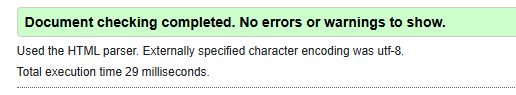
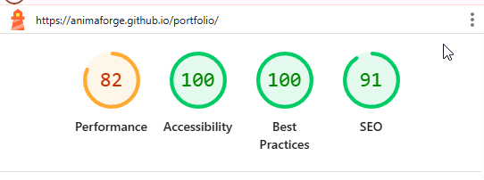

# Inlämningsuppgift 1: Portfolio - Josef Erraji

Detta är min första inlämningsuppgift i kursen BCU25D HTML & CSS. Projektet är en professionell portfolio webbplats byggd från grunden med HTML5 och CSS3.

**Live-version av sidan kan ses här:** https://animaforge.github.io/portfolio/

---

## Projektbeskrivning

Målet med projektet var att skapa en responsiv "one-page" portfolio för att presentera mig själv, mina projekt och mina kompetenser. Sidan är designad för att vara ren, professionell och lätt att navigera, med ett starkt fokus på innehåll och teknisk kvalitet.

## Hur jag har tänkt

Projektet är byggt med följande principer och tekniker för att uppfylla kursmålen:

*   **Mobile-First-strategi:** All styling är skriven för mobila enheter som bas, med anpassningar för större skärmar via en `@media` fråga. Detta säkerställer en optimal och snabb upplevelse på alla enheter.

*   **Moderna CSS Layout-tekniker:**
    *   **CSS Grid** används för att skapa ett flexibelt och robust rutnät för projektkorten.
    *   **Flexbox** används för att hantera layouten av sidokolumnen på ett effektivt och responsivt sätt.

*   **Semantisk HTML5:** Koden använder semantiska element som `<header>`, `<main>`, `<section>`, `<article>`, `<aside>` och `<footer>` för att förbättra sidans struktur, tillgänglighet och SEO.

*   **Tillgänglighet** Stor vikt har lagts vid tillgänglighet. Alla bilder har beskrivande `alt`-texter, formulärfält är korrekt länkade till sina `label`-element, och SVG-ikoner har `aria-label` för att ge kontext till hjälpmedelsanvändare.

---

## Tillgänglighetsgranskning

Sidan har granskats med de specificerade verktygen för att säkerställa hög teknisk kvalitet och tillgänglighet.

### W3C HTML Validator

Koden validerar utan några fel eller varningar.

### Google Lighthouse (Mobil)

Sidan uppnår höga poäng i alla kategorier, med 100% i Accessibility.

